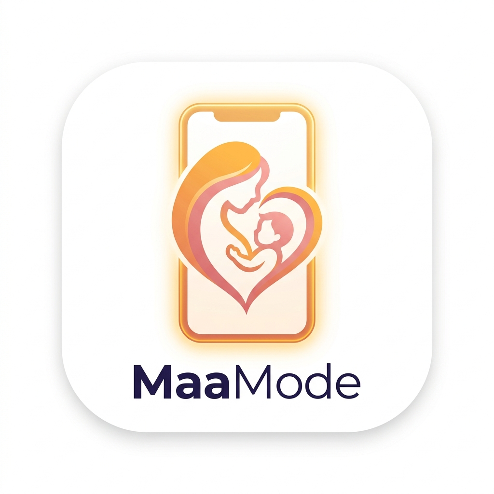

# MaaMode (माझं Mode / MaaMate) ❤️
> **"Don't make Mom learn the phone. Make the phone learn Mom."**  
> *Built for Mom for the DEV Hacktoberfest Weekend 2026 Challenge: "Build for a Friend"*



---

## 🌸 The Story: Why I Built This For My Mother

Every few days, my mother calls me with the same feeling of hesitation:  
*"बेटा, व्हॉट्सॲपवर कालच्या पूजेचा फोटो कसा पाठवू?"* (*How do I send yesterday’s puja photo on WhatsApp?*)  
*"हा आधार कार्डचा कागद कसा पाठवायचा?"* (*How do I send my Aadhaar Card PDF?*)  
*"मी बाजारात आले आहे, माझे लोकेशन कसे पाठवू?"* (*I am in the market, how do I share my live location?*)  
*"दुकानदाराला यूपीआयने पैसे कसे पाठवू?"* (*How do I send money via UPI?*)  
or  
*"हा इंग्रजीत डॉक्टरचा काय मेसेज आलाय? मला काही समजत नाहीये."* (*What does this English message from the doctor say? I don’t understand.*)

My mother is intelligent, capable, and eager to stay connected with family. But modern smartphones are designed with complex icons, hidden menus, and English-first interfaces. Whenever she tries to explore, she worries: *"What if I press the wrong button and delete something, or send money to the wrong person?"*

Most "assistants" fail her because they either:
1. Try to take over her phone and do things automatically (leaving her dependent), or
2. Throw walls of written technical instructions at her.

**MaaMode changes the paradigm.**  
Instead of doing everything *for* Mom, MaaMode is her patient, warm, Marathi-speaking personal smartphone tutor that guides her step-by-step until she can do it with total confidence.

---

## 🌟 The Philosophy: Independence Over AI Screen Time

In an era of hyper-engagement, MaaMode's north-star metric is unique:
> **"How many tasks can Mom perform independently today without needing the AI?"**

We measure success through **"Mom's Phone Skills"** unlocked badges, celebrating her growing confidence.

---

## 🧠 Why Open-Source AI is Mandatory

For this project, using proprietary commercial cloud APIs was an immediate non-starter. Here is why **Open-Weights AI (Gemma 2 2B / Llama 3.2 1B)** is the core foundation:

1. **Mom's Private World Remains Private**:
   - Mom’s smartphone contains private family photos, Aadhaar card scans, live GPS locations, and financial transactions. Sending raw data to commercial cloud APIs violates family privacy.
   - With Open-Source AI, inference is strictly local with **Zero Network Egress / Zero Telemetry**.
2. **Predictable Controlled Action Pipeline**:
   - Closed-source commercial models frequently update weights, hallucinate arbitrary outputs, or change safety policies.
   - MaaMode uses a strict, deterministic schema:
     $$\text{Spoken Marathi} \rightarrow \text{Intent Classification} \rightarrow \text{Whitelist Security Validator} \rightarrow \text{Tutorial / Confirmation}$$
   - The AI never has unsupervised access to execute arbitrary actions.
3. **Regional Language Warmth (Marathi / Devanagari)**:
   - Commercial models produce stiff, unnatural translations. Open models allow customized prompts honoring respectful Marathi idioms (*"करा"*, *"बघा"*, *"बाबांना पाठवायचा आहे का?"*).

---

## 🚀 Complete Suite of Interactive Tutorials ("SHOW ME")

Mom can tap any card or simply speak in natural Marathi to launch step-by-step spotlight guidance:

1. **📷 फोटो पाठवणे (Send Photo)**:
   - Spotlight: WhatsApp $\rightarrow$ Papa's chat $\rightarrow$ Paperclip $\rightarrow$ Gallery $\rightarrow$ Photo $\rightarrow$ Send $\rightarrow$ Double blue checkmarks.
2. **📄 डॉक्युमेंट / आधार कार्ड पाठवणे (Send Document & Aadhaar PDF)**:
   - Teaches Mom how to attach and send official documents/PDFs without fear of losing files.
3. **📍 सुरक्षिततेसाठी लाईव्ह लोकेशन पाठवणे (Share Live Location)**:
   - Critical safety feature when Mom travels alone: shows her how to share real-time GPS location with family for 1 hour.
4. **💸 यूपीआयने सुरक्षित पैसे पाठवणे (Send Money via UPI)**:
   - Step-by-step WhatsApp Pay / UPI tutorial highlighting the golden safety rule:
     > *"पैसे पाठवतानाच PIN टाकावा लागतो. पैसे स्वीकारण्यासाठी किंवा मिळवण्यासाठी कधीही PIN टाकू नये!"*
5. **🌸 व्हॉट्सॲप स्टेटस व कॅपशन ठेवणे (Post Status with Caption)**:
   - Teaches Mom how to switch to the Status tab, pick a festival photo, add a warm caption like *"शुभ सकाळ! 🌸"*, and share it with family.

6. **🛺 उबरवरून रिक्षा बुक करणे (Book Auto on Uber)**:
   - Built because Mom struggles to travel independently to clinics or markets:
     1. Tap Uber app on home screen
     2. Tap "Where to? (कुठे जायचे आहे?)"
     3. Select destination (e.g. Dr. Kulkarni Clinic)
     4. Select **Uber Auto (रिक्षा)** with upfront fare display (₹६५)
     5. Tap Confirm Auto
     6. **Safety First**: Displays driver name (*रमेश कांबळे*), vehicle plate (*MH 12 AB 4582*), and large 4-digit PIN (*७२९४*) with spoken instruction: *"गाडीचा नंबर तपासा आणि रिक्षात बसल्यावरच ड्रायव्हरला ७२९४ हा पिन सांगा."*

7. **💬 व्हॉट्सॲप मेसेज पाठवणे (Send Text Message)**:
   - Guided message typing and sending.

---

## 🛡️ "EXPLAIN THIS" & "HELP ME REPLY"

- **"EXPLAIN THIS"**: Translates and breaks confusing English messages (Doctor appointments, courier OTPs, electricity bills, bank warnings) into 3 simple cards: **काय आहे?**, **तुम्हाला काय करायचे आहे?**, and **काळजीचे कारण आहे का?**, with warm audio narration.
- **"HELP ME REPLY"**: Generates 3 contextual response options followed by the **Giant Safety Confirmation Sheet** (`[ ✅ हो, पाठवा / SEND ]` vs `[ ❌ नको, रद्द करा / CANCEL ]`).

---

## 📱 How to Run & Install on Phone

### Running Locally
```powershell
# In terminal, navigate to the project directory:
cd C:\Users\Ayushi_Shinde\.gemini\antigravity-ide\scratch\MaaMode

# Start local server:
python -m http.server 3000
```
Open `http://localhost:3000` in any browser or on Mom's mobile phone connected to your Wi-Fi network.

### Installing as a Mobile App (PWA)
1. Open `http://<your-computer-ip>:3000` in Chrome on Mom's phone.
2. Tap the three dots (⋮) and select **"Add to Home screen"** / **"Install App"**.
3. MaaMode will run full screen on her phone with the custom app icon!
